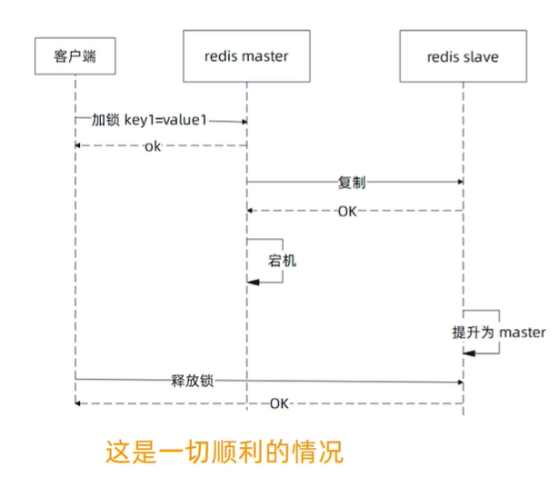
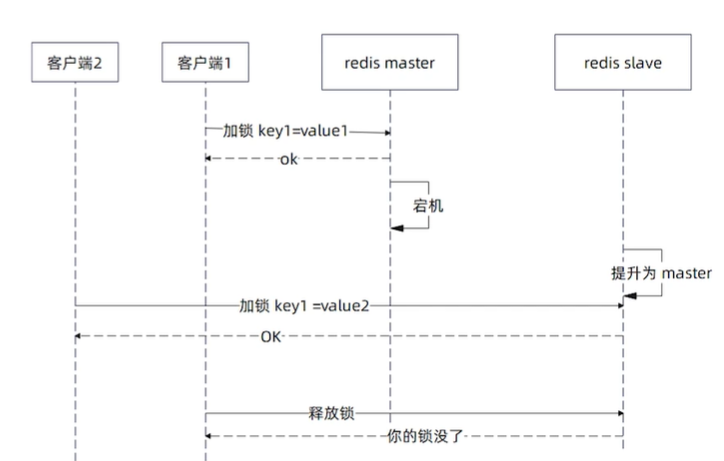

# redis-lock
## singleflight防缓存击穿神器

在非常高并发，并且热点集中的情况下，**可以考虑singleflight来进行优化**。也就是说，本地**所有的goroutine自己先竞争一把，胜利者再去抢全局的分布式锁**。

~~~go
func (c *Client) SingleFlightLock(ctx context.Context, key string, expiration time.Duration, retry RetryStrategy, timeout time.Duration) (*Lock, error) {
	for {
		//标记是不是自己拿到了锁
		flag := false
		resCh := c.s.DoChan(key, func() (interface{}, error) {
			flag = true
			return c.Lock(ctx, key, expiration, retry, timeout)
		})
		select {
		case res := <-resCh:
			//确实是自己拿到了锁
			if flag {
				if res.Err != nil {
					return nil, res.Err
				}
				return res.Val.(*Lock), nil
			}
		case <-ctx.Done():
			//监听超时
			return nil, ctx.Err()
		}
	}
}
~~~

问题：

使用 singleflight 我们比较常见的是直接使用 Do 方法，但是这个极端情况下会导致整个程序 hang 住，如果我们的代码出点问题，有一个调用 hang 住了，那么会导致所有的请求都 hang 住

解决问题：

使用DoChan结合select做超时控制。

## 分布式锁-Redis主从切换

Redlock之前几位大佬还 battle 过。思路都是类似的，就是我们这一次不再部署单一主从集群，而是多个主节点(没有从节点)。

比如说我们部署五个主节点，那么加锁过程是类似的，只是要在五个主节点上都加上锁，如果多数(这里是三个)都成功了，那么就认为加锁成功也就是红锁（Red Lock）。

## Redis 分布式锁面试要点

分布式锁的面试来来回回就是那么几个问题:

- **分布式锁怎么实现?**基本原理就是我们刚才讲的那些，核心就是 SetNX，只不过在我们引入重试之后就需要使用 lua 脚本了。
- **分布式锁的过期时间怎么设置?**按照自己业务的耗时，例如 999 线的时间设置超时时间，重要的是要弓入续约的机制。
- **怎么延长过期时间(续约)?**其实讨论的就是分布式锁续约的那几个问题，什么时候续约，续多长时间，续约失败怎么办?续约失败之后，无非就是中业务执行，并且可能还要执行一些回滚或者补偿动作。
- **分布式锁加锁失败有什么原因?**超时、网络故障、Redis 服务器故障，以及锁被人持有着。
- **怎么优化分布式锁的性能?**也没什么好办法，根源上还是尽量避免使用分布式锁，硬要用那就可以考虑使用 singleflight 来进行优化。

## 总结

- 使用分布式锁，你不能指望框架提供万无一失的方案，自己还是要处理各种异常情况(超时)
- 自己写分布式锁，要考虑过期时间，以及要不要续约
- 不管要对锁做什么操作，首先要确认这把锁是我们自己的锁
- 大多数时候，与其选择复杂方案，不如直接让业务失败，可能成本还要低一点。(有时候直接赔钱，比你部署一大堆节点，招一大堆开发，搞好几个机房还要便宜，而且便宜很多)也就是选择恰好的方案，而不是完美的方案。
